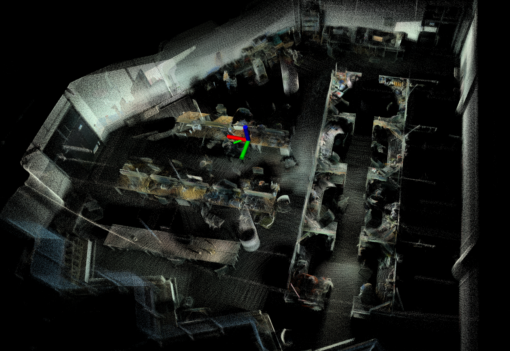
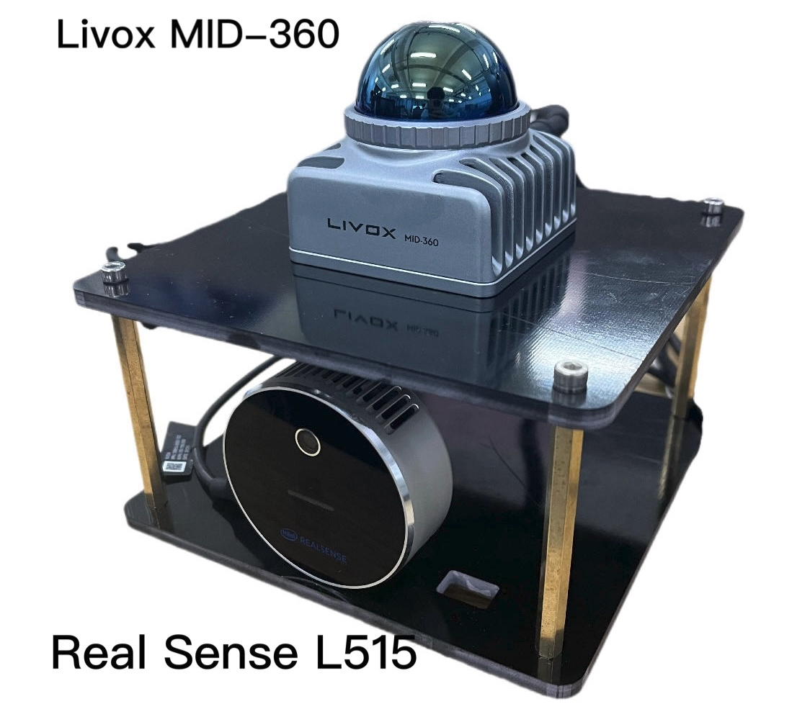

## FAST_LIO_COLOR_MAPPING
**A modified version of FAST-LIO2 that can generate RGB point cloud maps**

<p align="center">
  
  <br>
  <em>Fig 1 :Indoor Test</em>
</p>

## 1. Prerequisites
### 1.1 **Ubuntu** and **ROS**
**Ubuntu >= 16.04**

ROS    >= Melodic. [ROS Installation](http://wiki.ros.org/ROS/Installation)

### 1.2. **PCL && Eigen && OpenCV**
PCL    >= 1.8,   Follow [PCL Installation](http://www.pointclouds.org/downloads/linux.html).

Eigen  >= 3.3.4, Follow [Eigen Installation](http://eigen.tuxfamily.org/index.php?title=Main_Page).

Opencv >= 3.2.0, Follow[OpenCV_installation](https://github.com/opencv/opencv)
### 1.3. **livox_ros_driver**
Follow [livox_ros_driver Installation](https://github.com/Livox-SDK/livox_ros_driver).

## 2. Build

Clone the repository and catkin_make:

```
    cd ~/$A_ROS_DIR$/src
    git clone https://github.com/YWL0720/FAST-LIO-COLOR-MAPPING.git
    cd FAST_LIO_COLOR_MAPPING
    git submodule update --init
    cd ../..
    catkin_make
    source devel/setup.bash
```
- Remember to source the livox_ros_driver before build (follow 1.3 **livox_ros_driver**)
- If you want to use a custom build of PCL, add the following line to ~/.bashrc
```export PCL_ROOT={CUSTOM_PCL_PATH}```
## 3. Sensor Configuration
### 3.1 Extrinsic parameters
<p align="center">
  
  <br>
  <em>Fig 2 : Sensor Configuration</em>
</p>

We use the Livox MID-360 for point cloud and IMU input, and the Intel RealSense L515 for RGB image input.

The extrinsic parameters between the LiDAR and the camera are obtained through [direct_visual_lidar_calibration](https://github.com/koide3/direct_visual_lidar_calibration).
### 3.2 Time Synchronization
TODO

## 4. Run
```
roslaunch fast_lio_color_mapping mapping_mid360.launch
```
## 5. TODO
- Time Synchronization

## 6.Acknowledgments

Thanks for FAST-LIO2(Xu, Wei, et al. FAST-LIO2: Fast Direct LiDAR-inertial Odometry), [FAST-LIO2](https://github.com/hku-mars/FAST_LIO)
